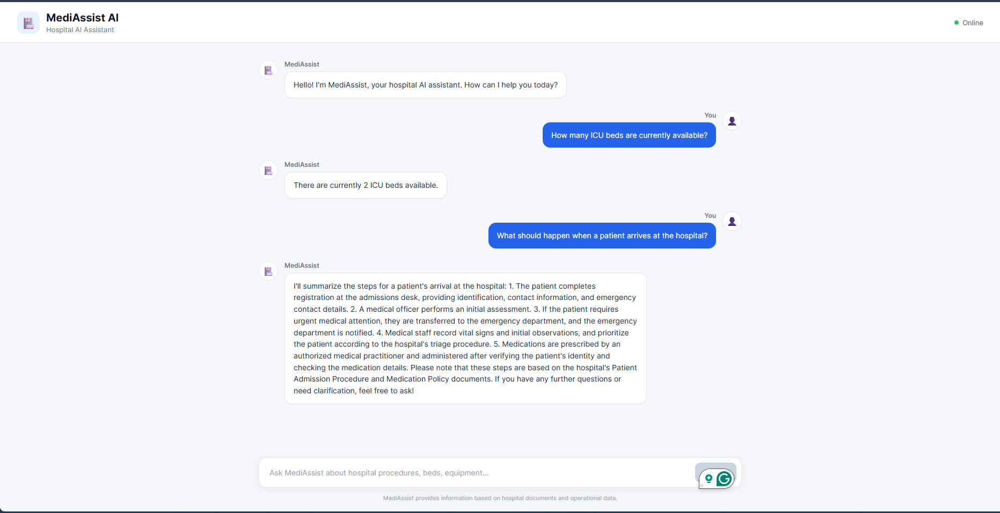
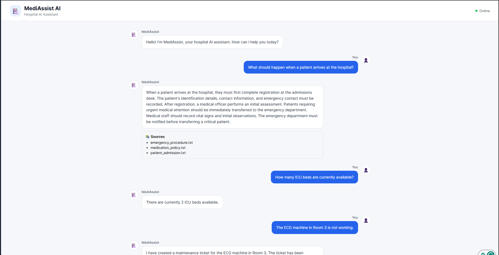
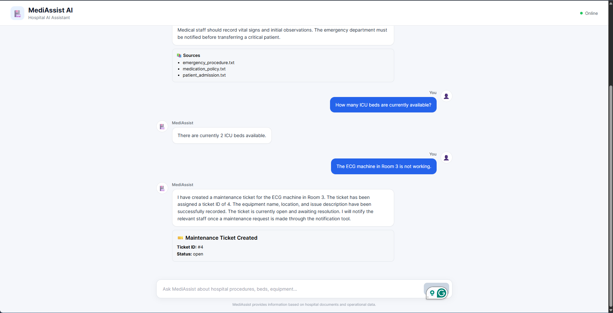
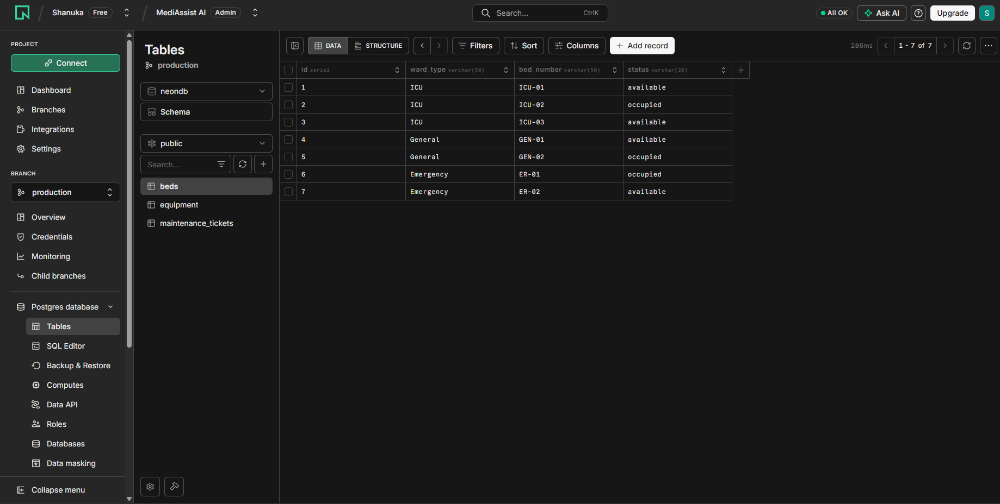
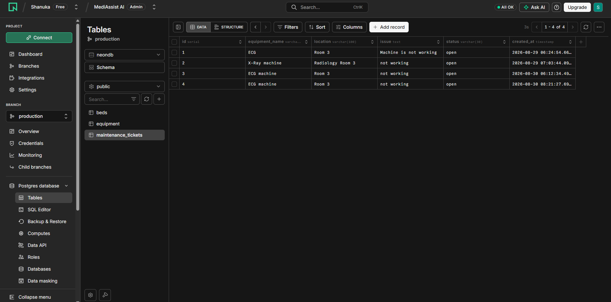

# 🏥 MediAssist AI

**MediAssist AI** is a full-stack AI-powered hospital assistant that combines **Retrieval-Augmented Generation (RAG)** with **AI tool calling and agent-based workflows**.

The system can answer questions using internal hospital documents and perform real-time hospital operational tasks such as checking bed availability, checking equipment status, and creating maintenance tickets.

The application runs locally using **Ollama** for the language model, **ChromaDB** for document retrieval, and **Neon PostgreSQL** for operational data.

---

## 📸 Application Screenshots

### 1. MediAssist AI — Chat Interface



### 2. RAG Response with Document Sources



### 3. Maintenance Ticket Creation



### 4. Neon PostgreSQL tables for beds availability



### 5. Neon PostgreSQL tables for maintenance tickets



---

# ✨ Features

## 🤖 AI Agent

* LangChain-based AI agent
* Local LLM powered by Ollama
* Automatic tool selection based on user intent
* Supports multiple tool calls within a conversation
* Structured operational responses
* System prompt controls agent behavior and prevents unsupported claims

## 📚 Retrieval-Augmented Generation

* Hospital documents stored locally
* Document chunking
* Semantic embeddings using `all-MiniLM-L6-v2`
* Persistent ChromaDB vector storage
* Semantic similarity search
* Retrieved context injection
* Answers grounded in hospital documentation
* Displays retrieved document sources in the frontend

## 🏥 Hospital Operational Tools

### Bed Availability

The agent can query the current availability of hospital beds.

Example:

> "How many ICU beds are currently available?"

The agent calls:

```text
get_available_beds()
```

and retrieves the current information from Neon PostgreSQL.

### Equipment Status

The agent can check the current status and location of hospital equipment.

Example:

> "What is the current status of the MRI machine?"

The agent calls:

```text
get_equipment_status()
```

### Maintenance Tickets

The agent can identify equipment problems from natural language and create maintenance tickets.

Example:

> "The ECG machine in Room 3 is not working."

The agent extracts:

```text
Equipment: ECG
Location: Room 3
Issue: Not working
```

and calls:

```text
create_maintenance_ticket()
```

The created ticket ID and status are displayed in the frontend.

---

# 🧠 Knowledge Questions vs Operational Requests

MediAssist supports two major types of requests.

### Knowledge Questions

Questions about hospital policies, procedures, and guidelines are handled through RAG.

```text
User
 ↓
AI Agent
 ↓
RAG Tool
 ↓
ChromaDB
 ↓
Hospital Documents
 ↓
Retrieved Context
 ↓
LLM
 ↓
Answer + Sources
```

Example:

> "What should happen when a patient arrives at the hospital?"

---

### Operational Requests

Requests requiring current hospital data are handled using AI tools.

```text
User
 ↓
AI Agent
 ↓
Select Tool
 ↓
Neon PostgreSQL
 ↓
Operational Result
 ↓
LLM
 ↓
Final Answer
```

Example:

> "Are there any ICU beds available?"

---

# 🏗️ System Architecture

```text
                         ┌──────────────────────┐
                         │     React Frontend   │
                         │      Chat UI         │
                         └──────────┬───────────┘
                                    │
                                    │ HTTP
                                    ▼
                         ┌──────────────────────┐
                         │   FastAPI Backend    │
                         │    /api/chat         │
                         └──────────┬───────────┘
                                    │
                                    ▼
                         ┌──────────────────────┐
                         │   MediAssist Agent   │
                         │      LangChain       │
                         └──────────┬───────────┘
                                    │
                       ┌────────────┴────────────┐
                       │                         │
                       ▼                         ▼
              ┌─────────────────┐      ┌──────────────────┐
              │   RAG Tool      │      │  AI Tools        │
              └────────┬────────┘      └────────┬─────────┘
                       │                        │
                       ▼              ┌─────────┼─────────┐
              ┌─────────────────┐     │         │         │
              │    ChromaDB     │     ▼         ▼         ▼
              │ Vector Database  │   Beds   Equipment  Tickets
              └────────┬────────┘     │         │         │
                       │              └─────────┴─────────┘
                       ▼                        │
              ┌─────────────────┐               ▼
              │ Hospital        │       ┌─────────────────┐
              │ Documents       │       │ Neon PostgreSQL │
              └─────────────────┘       └─────────────────┘

                       ┌──────────────────────┐
                       │    Ollama LLM        │
                       │      llama3.2        │
                       └──────────────────────┘
```

---

# 🔄 RAG Workflow

MediAssist uses Retrieval-Augmented Generation to answer questions from internal hospital documentation.

### 1. Document Loading

Hospital documents are stored in:

```text
documents/
```

Current documents include:

```text
emergency_procedure.txt
medication_policy.txt
patient_admission.txt
```

### 2. Chunking

Large documents are divided into smaller sections to improve retrieval accuracy.

### 3. Embedding Generation

Each document chunk is converted into a vector representation using:

```text
all-MiniLM-L6-v2
```

### 4. Vector Storage

The embeddings and metadata are stored in a persistent ChromaDB collection.

```text
hospital_documents
```

### 5. Query Embedding

When the user asks a knowledge question, the question is converted into an embedding using the same embedding model.

### 6. Semantic Search

ChromaDB searches for the most semantically relevant document chunks.

### 7. Context Injection

The retrieved chunks are provided to the LLM as context.

### 8. Grounded Generation

Ollama generates the final response using the retrieved hospital information.

### 9. Source Display

The source document names are returned by the backend and displayed in the React interface.

---

# 🛠️ AI Agent Workflow

The LangChain agent determines which tool should be used based on the user's request.

```text
                       User Question
                            │
                            ▼
                     ┌──────────────┐
                     │ AI Agent     │
                     └──────┬───────┘
                            │
              ┌─────────────┼─────────────┐
              │             │             │
              ▼             ▼             ▼
         RAG Tool       Bed Tool     Equipment Tool
              │             │             │
              ▼             │             │
          ChromaDB           │             │
                            └──────┬──────┘
                                   ▼
                           Neon PostgreSQL

                         Maintenance Tool
                                │
                                ▼
                         Neon PostgreSQL
```

The agent can select the appropriate tool without requiring the user to specify which tool to use.

---

# 🔧 Available AI Tools

| Tool                        | Purpose                                 | Data Source     |
| --------------------------- | --------------------------------------- | --------------- |
| `search_hospital_documents` | Search hospital policies and procedures | ChromaDB        |
| `get_available_beds`        | Check available beds                    | Neon PostgreSQL |
| `get_equipment_status`      | Check equipment status                  | Neon PostgreSQL |
| `create_maintenance_ticket` | Create equipment maintenance tickets    | Neon PostgreSQL |

---

# 🗄️ Database Structure

Neon PostgreSQL contains three main tables.

## Beds

Stores hospital bed information.

```text
beds
├── id
├── bed_number
├── ward_type
└── status
```

Example ward types:

```text
ICU
General
Emergency
```

---

## Equipment

Stores hospital equipment information.

```text
equipment
├── id
├── name
├── location
└── status
```

---

## Maintenance Tickets

Stores equipment maintenance requests.

```text
maintenance_tickets
├── id
├── equipment_name
├── location
├── issue
├── status
└── created_at
```

---

# 💻 Technology Stack

## Frontend

* React
* TypeScript
* Vite
* CSS

## Backend

* Python
* FastAPI
* Pydantic

## AI

* Ollama
* Llama 3.2
* LangChain
* LangChain Ollama
* LangChain Tools / Agents

## RAG

* ChromaDB
* Sentence Transformers
* `all-MiniLM-L6-v2`

## Database

* PostgreSQL
* Neon PostgreSQL
* SQLAlchemy

---

# 📁 Project Structure

```text
MediAssist AI/
│
├── chroma_db/
│   └── Persistent ChromaDB storage
│
├── documents/
│   ├── emergency_procedure.txt
│   ├── medication_policy.txt
│   └── patient_admission.txt
│
├── frontend/
│   ├── src/
│   │   ├── App.tsx
│   │   ├── App.css
│   │   ├── index.css
│   │   └── main.tsx
│   ├── package.json
│   └── ...
│
├── src/
│   ├── tools/
│   │   ├── hospital_tools.py
│   │   └── rag_tools.py
│   │
│   ├── agent.py
│   ├── hospital_agent.py
│   ├── main.py
│   ├── database.py
│   ├── chroma_db_client.py
│   ├── schema.sql
│   ├── create_tables.py
│   ├── seed.py
│   └── ...
│
├── screenshots/
│   ├── 01-chat-interface.png
│   ├── 02-rag-response.png
│   ├── 03-bed-availability.png
│   ├── 04-equipment-status.png
│   └── 05-maintenance-ticket.png
│
├── .env
├── .gitignore
├── requirements.txt
└── README.md
```

---

# ⚙️ Requirements

Before running the project, install:

* Python 3.9+
* Node.js and npm
* Ollama
* PostgreSQL-compatible Neon database

---

# 🚀 Installation

## 1. Clone the Repository

```bash
git clone <your-github-repository-url>

cd "MediAssist AI"
```

---

## 2. Create Python Virtual Environment

```bash
python -m venv venv
```

Activate it on Windows:

```powershell
venv\Scripts\Activate.ps1
```

---

## 3. Install Python Dependencies

```bash
pip install -r requirements.txt
```

---

## 4. Install Ollama

Install Ollama from:

https://ollama.com/

Then download the Llama 3.2 model:

```bash
ollama pull llama3.2
```

Make sure Ollama is running before starting the backend.

---

# 🔐 Environment Variables

Create a `.env` file in the project root.

Example:

```env
DATABASE_URL=your_neon_postgresql_connection_string
```

Do not commit `.env` to GitHub.

Make sure it is included in `.gitignore`.

---

# 🗄️ Setup PostgreSQL

Create the required tables:

```bash
cd src

python create_tables.py
```

Seed the database with sample hospital data:

```bash
python seed.py
```

---

# 📚 Setup ChromaDB

Index the hospital documents:

```bash
python chroma_db_client.py
```

This creates the persistent ChromaDB collection used by the RAG pipeline.

---

# ▶️ Running the Application

MediAssist requires both the FastAPI backend and React frontend.

## Start the Backend

From the `src` directory:

```bash
uvicorn main:app --reload
```

The API will be available at:

```text
http://127.0.0.1:8000
```

Swagger API documentation:

```text
http://127.0.0.1:8000/docs
```

---

## Start the Frontend

Open another terminal:

```bash
cd frontend
```

Install dependencies:

```bash
npm install
```

Start the development server:

```bash
npm run dev
```

The React application will normally be available at:

```text
http://localhost:5173
```

---

# 💬 Example Queries

### Hospital Knowledge

```text
What should happen when a patient arrives at the hospital?
```

```text
What should healthcare staff do if a patient has an adverse reaction to medication?
```

```text
What should happen to a critical patient?
```

### Bed Availability

```text
How many ICU beds are currently available?
```

### Equipment Status

```text
What is the current status of the MRI machine?
```

### Maintenance

```text
The ECG machine in Room 3 is not working.
```

The agent extracts the required information and creates a maintenance ticket.

---

# 🔌 API Response

The `/api/chat` endpoint returns structured information:

```json
{
  "response": "There are currently 2 ICU beds available.",
  "sources": [],
  "ticket_id": null,
  "ticket_status": null,
  "tools": [
    "get_available_beds"
  ]
}
```

For a RAG query:

```json
{
  "response": "When a patient arrives...",
  "sources": [
    "patient_admission.txt",
    "emergency_procedure.txt"
  ],
  "ticket_id": null,
  "ticket_status": null,
  "tools": [
    "search_hospital_documents"
  ]
}
```

For a maintenance request:

```json
{
  "response": "A maintenance ticket has been created.",
  "sources": [],
  "ticket_id": 3,
  "ticket_status": "open",
  "tools": [
    "create_maintenance_ticket"
  ]
}
```

---

# 🧪 Testing

The following scenarios were used to test the system:

| Scenario                        | Expected Behavior                  |
| ------------------------------- | ---------------------------------- |
| Hospital procedure question     | RAG retrieval                      |
| Medication policy question      | RAG retrieval                      |
| ICU bed availability            | Bed tool                           |
| MRI status                      | Equipment tool                     |
| Equipment failure report        | Maintenance tool                   |
| Missing maintenance information | Agent requests missing information |
| Unknown equipment               | Tool reports equipment not found   |

---

# 🔒 Safety and Grounding

MediAssist is designed to reduce unsupported responses by following several principles:

* Hospital policy questions are answered using retrieved hospital documents.
* Operational information is retrieved from PostgreSQL.
* Database information is not invented.
* Maintenance tickets are only reported as created after successful tool execution.
* The system does not claim that staff were notified unless a notification mechanism is actually implemented.
* Missing information required for an operation should be requested from the user.

---

# 📌 Current Scope

This project is designed as an **educational and portfolio demonstration of RAG and agentic AI architecture**.

It currently focuses on:

* Hospital document question answering
* Semantic retrieval
* AI tool selection
* Bed availability
* Equipment status
* Maintenance ticket creation
* Full-stack AI application development

Future improvements could include:

* Authentication and role-based access
* Streaming responses
* Conversation memory
* Real-time notifications
* Hospital staff dashboards
* Ticket management
* More sophisticated retrieval and reranking
* Production-grade observability
* Automated evaluation of RAG responses

---

# 📖 Resources

* [LangChain](https://www.langchain.com/)
* [ChromaDB](https://www.trychroma.com/)
* [Ollama](https://ollama.com/)
* [FastAPI](https://fastapi.tiangolo.com/)
* [Neon](https://neon.tech/)
* [Sentence Transformers](https://www.sbert.net/)

---

# ⚠️ Disclaimer

MediAssist AI is an educational portfolio project and **must not be used as a substitute for professional medical advice, clinical judgment, or official hospital procedures**.

Information provided by the system should always be verified against approved hospital documentation and qualified healthcare professionals.
